## 아주대학교 SW 캡스톤 디자인 - Team Nomad [](https://www.travis-ci.com/ajou-nomad/nomad-backend)
### Title: Dutch Delivery

---
# 프로젝트 소개

## 더치딜리버리란?

더치딜리버리는 <b>위치 기반 공동 배달 플랫폼</b>이다.

소비자들은 동일한 위치, 시간에 여러 사람과 같이 배달에 참여하여 부담되었던 <b>배달비와 최소 주문 금액 걱정 없이</b> 배달을 즐기고, 점주는 여러 명의 주문을 한 번에 보내기 때문에 <b>기존보다 적은 수수료로 더 많은 배달 서비스</b>를 제공받으며, 배달원은 저희가 새롭게 규정한 수수료 정책에 혜택을 받아 <b>노동에 비해 더 많은 수수료를</b> 얻어가는 배달 서비스를 제공해줍니다.

## 개발 동기 및 목적

최근에 코로나 19로 인하여 외식이나 모임이 줄어들고 집에 있는 시간이 늘어남에 따라 <b>배달 서비스가 많이 이용되는 추세</b>이다. 그에 따라 개인이 배달을 시키는 경우도 늘어나게 되었는데 기존의 서비스는 <b>최소주문금액이 높아 개인이 주문을 하지 못하는 경우</b> 가 생기고 최소주문금액을 맞추었더라도 <b>배달비가 추가되어 배달 서비스를 이용할 때 재정적 부담이 예상보다 커지는 경우</b> 가 많이 일어난다. 또한 늘어나는 배달 수수료로 인하여 가게 점주들도 <b>배달 서비스를 사용하는데 경제적 부담</b> 을 가지고 있으며 배달 서비스의 사용이 늘어남에 따라 <b>배달원들의 전체 노동시간이 증가</b> 되고 있는 상황이다. 이러한 여러 이해관계자들의 불편들을 해소하기 위하여 ‘더치딜리버리’라는 서비스를 개발하였다.

## 기대효과

우리는 더치딜리버리를 통하여 기존의 배달 서비스에서 생긴 불편사항들을 해결하고자 하며 그로 인하여 배달 서비스가 더 활성화되는 것을 목표로 하고 있다.

## Architecture
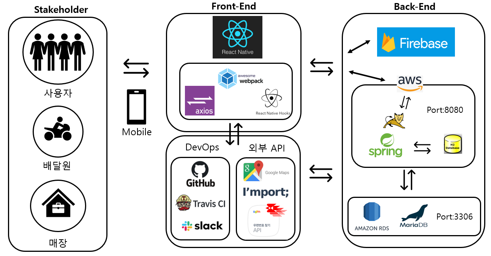

# **[-> Frontend 소개 및 모든 기능 보기 <-](https://github.com/ajou-nomad/nomad-frontend)**

---

# 1. backend

## 1.1 Development Tools


## 1.2 Spring Setting
application.yml
```

# FOR AMAZON RDS // 실제 서비스 DB
spring:
  datasource:
    url: #RDS url
    username: #RDS admin
    password: #RDS password
    driver-class-name: org.mariadb.jdbc.Driver

  jpa:
    generate-ddl: true
    hibernate:
    ddl-auto: create
  properties:
    hibernate:
      show_sql: true
      format_sql: true
logging.level:
  org.hibernate.SQL: debug
  org.hibernate.type: trace
  
# FOR LOCAL DATABASE(H2) // 테스트 및 개발
spring:
  datasource:
    url: jdbc:h2:tcp://localhost/~/test
    username: sa
    password:
    driver-class-name: org.h2.Driver
  jpa:
    generate-ddl: true
    hibernate:
    ddl-auto: create-drop
  properties:
    hibernate:
      show_sql: true
      format_sql: true
logging.level:
  org.hibernate.SQL: debug
  org.hibernate.type: trace


```


# 2. CI/CD

## 2.1 DevOps/Test Tools


## 2.2 CI/CD Architecture
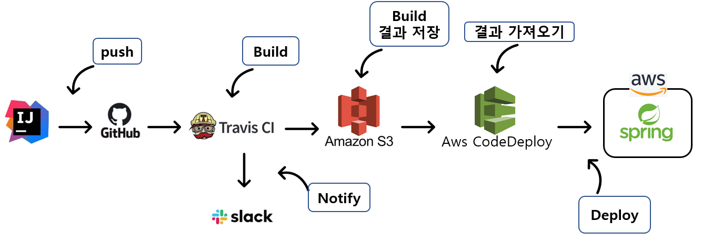

## 2.3 Build/Notify/Deploy 
.travis.yml : Build, Notify, Deploy의 information Setting
```
language: java
jdk:
  - openjdk11

branches:
  only:
    - master

# Travis CI 서버의 Home
cache:
  directories:
    - '$HOME/.m2/repository'
    - '$HOME/.gradle'

script: "./gradlew clean build"

before_install:
  - chmod +x gradlew
# CI 실행 완료시 메일로 알람
notifications:
  email:
    recipients:
      - gmail주소
  slack: nomad 슬랙 주소

before_deploy:
  - zip -r nomad *
  - mkdir -p deploy
  - mv nomad.zip deploy/nomad.zip
  -
deploy:
  - provider: s3
    access_key_id: $AWS_ACCESS_KEY
    secret_access_key: $AWS_SECRET_KEY
    bucket: leesk
    region: ap-northeast-2
    skip_cleanup: true
    acl: public_read
    local_dir: deploy
    wait-until-deployed: true
    on:
      repo: ajou-nomad/nomad-backend
      branch: master

  - provider: codedeploy
    access_key_id: $AWS_ACCESS_KEY # Travis repo settings에 설정된 값
    secret_access_key: $AWS_SECRET_KEY # Travis repo settings에 설정된 값
    bucket: leesk # S3 버킷
    key: nomad.zip # 빌드 파일을 압축해서 전달
    bundle_type: zip
    application: nomad # 웹 콘솔에서 등록한 CodeDeploy 어플리케이션
    deployment_group: Team-nomad # 웹 콘솔에서 등록한 CodeDeploy 배포 그룹
    region: ap-northeast-2
    wait-until-deployed: true
    on:
      repo: ajou-nomad/nomad-backend
      branch: master
```

appspec.yml : Deploy가 되고 난 후, 실행될 명령어 모집 hooks Setting
```
version: 0.0
os: linux
files:
  - source:  /
    destination: /home/ec2-user/app/travis/build

hooks:
  AfterInstall: # 배포가 끝나면 아래 명령어를 실행
    - location: execute-deploy.sh
      timeout: 180
```

# 3. 데이터베이스

## 3.1 데이터베이스 전체 개요
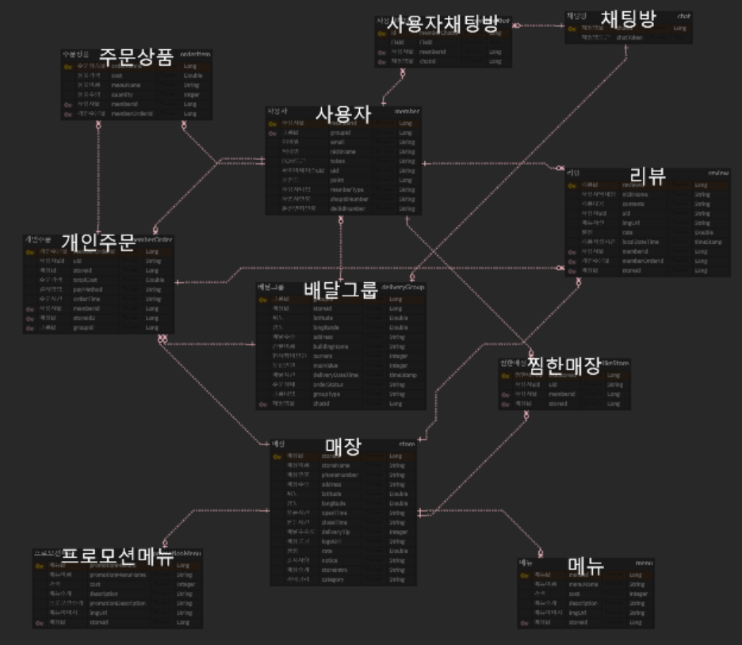

[데이터베이스 사이트 바로가기](https://www.erdcloud.com/d/7AzuwXxHN6HnoKKhc)

## 3.2 데이터베이스 Detail

### 3.2.1 사용자

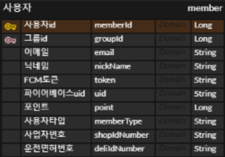
- memberId: member 엔티티의 primary Key
- groupId: 사용자가 그룹에 참여했을시, member 엔티티와 group 엔티티의 일대다 관계 매핑을 위한 foreign key
- email: 사용자 이메일
- nickName: 사용자가 사용할 닉네임
- token: Firebase cloud messaging을 위한 토큰 값
- uid: 파이어베이스와 같이 연동해서 사용하기 위한 사용자 uid
- point: 취소, 주문 이동에 유연하게 대처하기 위한 포인트
- memberType: 사용자, 매장, 배달원을 구분하기 위한 타입값
- shopIdNumber: 매장 가입시 필요한 사업자 번호
- deliIdNumber: 배달원 가입시 필요 운전면허번호

### 3.2.2 개인주문
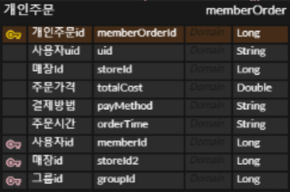
- memberOrderId: memberOrder 엔티티의 primary key
- storeId: 연관관계 매핑을 해놨지만 좀 더 간편하게 조회할 필요가 있어서 추가 등록
- totalCost: 주문 상품의 총 가격
- payMethod: 결제 장법
- orderTime: 주문 시간
- memberId: 사용자가 주문을 헀을 시, 사용자는 자신의 주문을 식별할 필요가 있기 때문에 memberOrder 엔티티와 member 엔티티간의 일대다 관계 매핑을 위한 foreign key
- storeId2: 사용자가 주문을 했을 시, 해당 매장에서도 주문을 식별할 필요가 있기 때문에 memberOrder 엔티티와 store 엔티티간의 일대다 관계 매핑을 위한 foreign key
- groupId: 사용자가 그룹에 참여했을 시, group 엔티티에서 그룹에 참여하고 있는 사용자들의 주문을 식별할 필요가 있기 때문에 memberOrder 엔티티와 group 엔티티 매핑을 위한 foreign key

### 3.2.3 주문목록
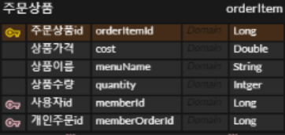
- orderItemId: orderItem 엔티티의 primary key
- cost: 주문 상품 가격
- menuName: 주문한 메뉴 이름
- quantity: 주문 수량
- memberId: 사용자에서 memberOrder를 통해서 식별하기 보다 member를 가지고 주문 상품을 식별하는게 더 편리하다고 판단하여 member 엔티티와 orderItem 엔티티 일대다 매핑을 위한 foreign key
- memberOrderId: memberOrder에서 주문한 상품을 식별할 수 있어야 하기 때문에 memberOrder 엔티티와 orderItem 엔티티 일대다 관계 매핑을 위한 foreign key

### 3.2.4 배달그룹
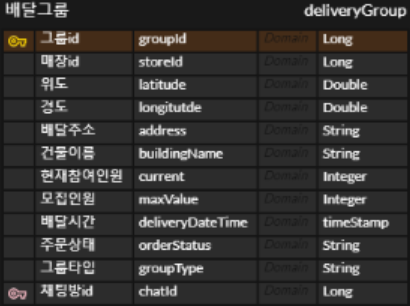
- groupId: deliveryGroup 엔티티의 primary key
- storeId: 해당 배달의 주문이 어떤 매장에 주문했는지 알아야 되므로 storeId 저장
- latitude: 해당 배달의 목적지 위도
- longitude: 해당 배달의 목적지 경도
- address: 해당 배달의 목적지 주소
- buildingName: 건물로 배달해야 하므로 정확한 건물 이름정보
- current: 현재 배달그룹에 참여중인 인원
- maxValue: 모집해야하는 인원
- deliveryDateTime: 배달 도착 시간
- orderStatus: 주문의 현재 상태를 식별하기 위한 attribute(recruiting, recruitmentDone, recruitmentAccept, waitingForDelivery, delivering, deliveryDone)
- groupType: 그룹이 당일모집인지 주간모집인지를 식별
- chatId: 채팅방을 만들때, 배달그룹을 기준으로 속해있는 사용자들을 식별해야 하므로 deliveryGroup 엔티티와 chat 엔티티 일대일 관계 매핑을 위한 foreign key  

### 3.2.5 매장
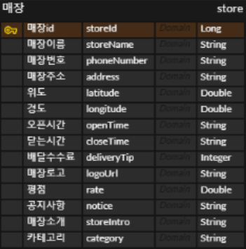
- storeId: store 엔티티의 primary key
- storeName: 매장 이름
- phoneNumber: 매장 전화번호
- address: 매장 주소
- latitude: 매장 위도
- longitude: 매장 경도
- openTime: 매장 오픈시간
- closeTime: 매장 닫는시간
- deliveryTip: 배달 수수료
- logoUrl: 매장 로고 url
- rate: 매장 평점
- notice: 매장 공지사항
- storeIntro: 매장 소개
- category: 매장의 카테고리 분류를 위한 attribute

### 3.2.6 찜한매장
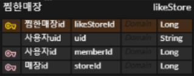
- likeStoreId: likeStore 엔티티의 primary key
- uid: 사용자 식별을 편리하게 하기 위해 uid값 저장
- memberId: 사용자가 여러매장을 찜할 수 있으므로 member 엔티티와 likeStore 엔티티 일대다 관계 매핑을 위한 foreign key
- storeId: 한 매장을 여러 사용자가 찜할 수 있으므로 store 엔티티와 likeStore 엔티티 일대다 관계 매핑을 위한 foreign key

### 3.2.7 메뉴
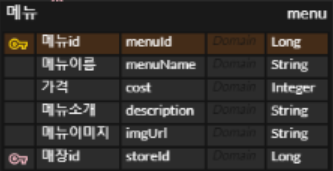
- menuId: menu 엔티티의 primary key
- menuName: 메뉴 이름
- cost: 메뉴 가격
- description: 메뉴 소개
- imgUrl: 메뉴 imgUrl
- storeId: 메뉴는 매장에 속해야 하므로 store 엔티티와 menu 엔티티 일대다 관계 매핑을 위한 foreign key

### 3.2.8 프로모션메뉴
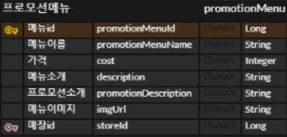
- promotionMenuId: promotionMenu 엔티티의 primary key
- promotionMenuName: 프로모션메뉴 이름
- cost: 프로모션메뉴 가격
- description: 프로모션메뉴 소개
- promotionDescription: 프로모션 소개
- imgUrl: 프로모션메뉴 imgUrl
- storeId: 프로모션메뉴도 매장에 속해야 하므로 store 엔티티와 promotionMenu 엔티티 일대일 관계 매핑을 위한 foreign key

### 3.2.9 리뷰
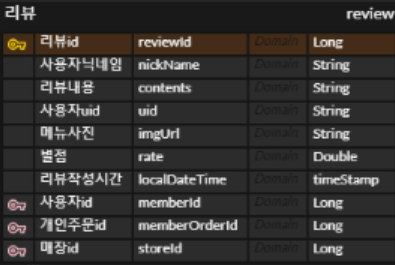

- reviewId: review 엔티티의 primary key
- nickName: 리뷰 남긴 사람의 닉네임
- contents: 리뷰 내용
- uid: 리뷰 작성자를 빠르게 조회하기 위한 uid
- 메뉴사진: imgUrl
- rate: 리뷰에 남길 별점
- localDateTime: 리뷰 작성시간
- memberId: 사용자가 리뷰를 볼 수 있어야 하므로 member 엔티티와 review 엔티티의 일대다 관계 매핑을 위한 foreign key
- memberOrderId: 사용자는 주문에 대해서 리뷰를 작성해야 하기때문에 memberOrder 엔티티와 review 엔티티 일대다 관계 매핑을 위한 foreign key
- storeId: 자신의 매장과 관련된 리뷰도 확인할 수 있어야 하기때문에 store 엔티티와 review 엔티티 일대다 관계 매핑을 위한 foreign key

### 3.2.10 채팅방
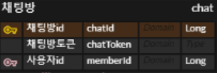
- chatId: chat 엔티티의 primary key
- chatToken: 채팅방 생성을 위한 Token 값
- memberId: 한명의 사용자가 여러 채팅방에 들어갈 수 있기 때문에 member 엔티티와 chat 엔티티 일대다 관계 매핑을 위한 foreign key

### 3.2.11 사용자채팅방
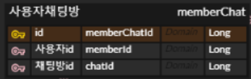
- memberChatId: memberChat 엔티티의 primary key
- memberId: 채팅방과 사용자의 다대다 매핑을 풀기 위해 member 엔티티와 memberChat 엔티티의 일대다 관계 매핑을 위한 foreign key
- chatId: 채팅방과 사용자의 다대다 매핑을 풀기 위해 chat 엔티티와 memberChat 엔티티의 일대다 관계 매핑을 위한 foreign key

# 4. API

POST `/member`: 회원가입<br>
POST `/memberOrderCancel` : 주문취소(조건: 모집완료 되지 않는 주문) <br>
GET `/member` : DB에 저장되어 있는 member 정보 중에 토큰을 조회해서 회원가입이 되어있는지 확인<br>
GET `/memberList` : 가입된 회원목록 조회<br>
GET `/memberOrderList` : 사용자의 주문내역 불러오기 (주문목록, 작성리뷰 포함)<br>

POST `/deliveryGroup` : 배달그룹 생성<br>
POST `/deliveryGroupJoin` : 그룹 참여<br>
POST `/deliveryGroupOrder` : 모집 완료된 주문 상태 변경(매장에서 접수)<br>
GET `/deliveryGroupOrder` : 모집 완료된 주문 불러오기 <br>
GET `/alldeliveryGroupOrder` : 모집중, 모집완료 주문을 제외한 배달 불러오기, 매장 관리용 <br>
GET `/allGroupList` : 생성된 배달 그룹 전부 불러오기<br>
GET `/dailyGroupList` : 당일 모집 배달 그룹 전부 불러오기<br>
GET `/weeklyGroupList` : 주간 모집 배달 그룹 전부 불러오기<br>
GET `/deliveryComplete` : 배달 완료된 그룹 불러오기(매장 보관용)

POST `/store` : 매장 생성<br>
GET `/storeList` : 배달 그룹 생성할 때, 전체 매장 불러오기(메뉴, 리뷰 포함)<br>
GET `/myStoreList` : 관리하는 매장 불러오기<br>
GET `/sales` : 월별 총매출 불러오기<br>

POST `/menu` : 메뉴 등록<br>
POST `/deleteMenu` : 메뉴 삭제<br>
POST `/modifyMenu` : 메뉴 수정<br>
POST `/addMenu` : 메뉴 추가<br>
POST `/promotionMenu` : 프로모션 메뉴 등록<br>

POST `/likeStore` : 찜한 매장 등록<br>
POST `/deleteLikeStore` : 찜한 매장 삭제<br>
GET `/likeStore` : 찜한 매장 불러오기<br>

POST `/chatId` : 채팅방을 위한 ChatToken 부여<br>
GET `/chatId` : 회원이 참여하고 있는 채팅방의 토큰들 불러오기<br>

POST `/review` : 사용자의 리뷰 작성<br>
POST `/deleteReview` : 사용자 리뷰 삭제<br>
GET `/memberReview` : 사용자 로그인 시, 사용자가 작성한 리뷰 불러오기<br>
GET `/storeReview` : 매장 로그인 시, 매장을 대상으로 작성된 리뷰 불러오기<br>

POST `/delivery` : 배달 접수하기(채팅방 생성 포함)<br>
POST `/deliveryComplete` : 배달 완료<br>
GET `/delivery` : 배달이 필요한 주문들 불러오기 (WaitingForDelivery 상태인 배달들)

# 5. 스케쥴러
- Spring의 `@Scheduled`를 사용해 구현

## 5.1 그룹 배달 시간이 되었는데 모집이 완료 되지 않은 상황
해당 배달 그룹은 모집 취소가 되며, 해당 그룹에 참여한 사람들의 결제금액은 포인트로 돌려준다.

## 5.2 `시간`을 기준으로 1시간 내외가 남았는데 아직 모집이 완료되지 않은 상황
해당 배달 그룹 사람들에게 다른 배달 그룹을 추천해주며, 추천 기준은 200M 내외이고 모집된 인원이 기존 배달 그룹보다 많이 모인 그룹중에, 동일한 이름의 매장에 배달한 그룹 또는 동일한 카테고리를 가진 매장에 배달한 그룹을 추천해준다.